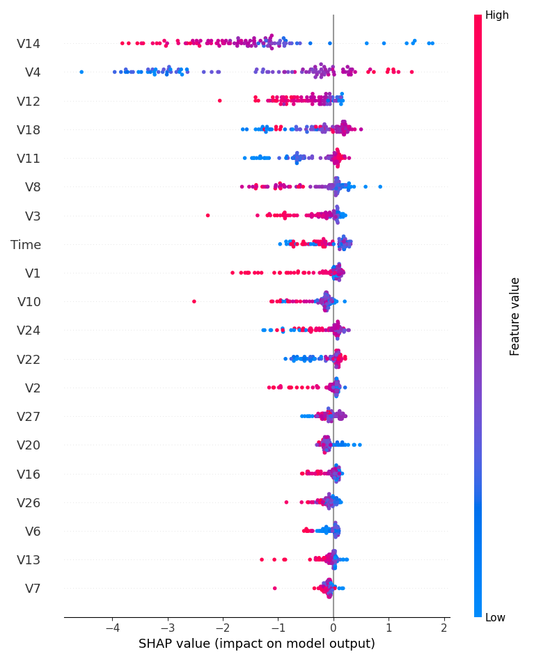

# 🛡️ Détection de Fraude par Carte Bancaire

Ce projet utilise le Machine Learning pour identifier des transactions frauduleuses à partir d'un dataset hautement déséquilibré. L'objectif est de maximiser la détection des fraudes (Recall) tout en minimisant les fausses alertes.

## 📊 Analyse des Données (EDA)
* **Dataset :** Crédit Card Fraud Detection (Kaggle).
* **Déséquilibre :** Les fraudes représentent seulement **0,17%** des transactions.
* **Anonymisation :** Les variables $V_1$ à $V_{28}$ sont issues d'une **Analyse en Composantes Principales (PCA)** pour protéger la confidentialité bancaire.


## 🛠️ Pipeline Technique
Pour résoudre les défis du dataset, j'ai mis en place :
1. **Prétraitement :** Mise à l'échelle des montants avec `StandardScaler`.
2. **Équilibrage :** Application de **SMOTE** (Synthetic Minority Over-sampling Technique) pour générer des exemples synthétiques de fraudes.
3. **Modélisation :** - **XGBoost :** Pour sa rapidité et sa précision sur les données structurées.
   - **MLP (Réseau de Neurones) :** Pour capturer des relations complexes.

## 🔍 Explicabilité du Modèle (SHAP)
L'utilisation de **SHAP (SHapley Additive exPlanations)** permet d'ouvrir la "boîte noire" du modèle. On peut identifier quelles variables ($V_{17}$, $V_{14}$, etc.) ont le plus d'influence sur la classification d'une transaction comme frauduleuse.



## 🚀 Installation et Usage
1. Téléchargez le dataset `creditcard.csv` sur [Kaggle](https://www.kaggle.com/datasets/mlg-ulb/creditcardfraud).
2. Installez les dépendances :
   ```bash
   pip install -r requirements.txt
